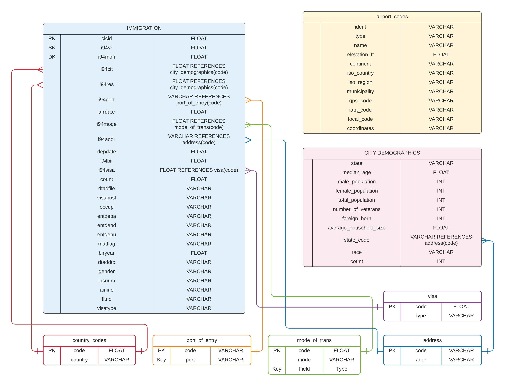

# Udacity Data Engineering Capstone Project

This project builds a data pipeline for an analytics database. It queries immigration datasets and builds tables in AWS Redshift after data quality checks. The pipeline is orchestrated with Apache Airflow. This project uses datasets provided by Udacity. More info about the data under the heading *Datasets*


### **General Workflow**
1. The first step in the project is to gather datasets from various sources. In this case much of the data was already provided by Udacity. More info about the data under the heading *Datasets*
2. Explore the datasets with pySpark, perform initial data quality checks. See [capstone_notebook.ipynb](./capstone_notebook.ipynb) for a more elaborate description of the exploratory data analysis and initial data quality checks.
3. After exploration, move on to conceptualizing  the data model and creating the schemas.



There are 3 main tables: *Immigration, airport_codes* and *city_demographics*. *Immigration* is SAS data and the other 2 are in csv format. I'm using a star schema to model the data. *Immigration* is the fact table. *cicid* is the the primary key (PK). *i94yr* is the sortkey(SK) and *i94mon* is the distribution key (DK).

Additionally there are 5 dimension tables: *country_codes, port_of_entry, mode_of_trans, address, visa*. These tables were created by parsing a SAS file.


4. Conceptualize the pipelines. Set up staging tables in S3 and then copy the data in S3 bucket to Redshift. For the Immigration fact table, airport_codes and city_demographics the tables are copied from s3, followed by a quality check and then created in Redshift. For the dimension tables the data is extracted from a SAS file *I94_SAS_Labels_Descriptions.SAS*, then staged to s3, followed by a quality check and then created in Redshift.
5. Execution: Build the data pipeline and run the dags in Airflow as described in step 4

### **Setup Instructions**
- Make sure you have Python 3 and all packages and dependencies installed.
- Make sure you have an AWS account. Set up a bucket in S3 and create a Redshift cluster
- Run the Airflow web server and scheduler
- Fill out AWS credentials in ```config.cfg```
- run ```python create_tables.py```
-  In the Airflow UI set up the AWS connection and then the Redshift connection
- Finally run the DAG in Airflow

### **Datasets**
- I94 Immigration Data: data from the US National Tourism and Trade Office.  It reports the visitor arrivals in the US from countries of origin, port of entry, visa type and address among others. Click link for [source](https://travel.trade.gov/research/reports/i94/historical/2016.html)
- U.S. City Demographic Data:  contains information about the demographics of all US cities and census-designated places with a population greater or equal to 65,000. Click link for [source](https://public.opendatasoft.com/explore/dataset/us-cities-demographics/export/)
- Airport Code Table:  table of IATA airport codes and corresponding cities. It also includes ICAO airport codes. Click link for [source](https://datahub.io/core/airport-codes#data)

### **Techology Choices**
- **s3**: Solid option for storing and staging raw data before building and filling the analytics tables.
- **Redshift**: Comprehensive solution to store distributed scalable data. Queryable with SQL and latches in very well with s3. 
- **Apache Airflow**: Good option to schedule and monitor ETL workflows. It has a somewhat tricky UI, but it can perform timely updates at scheduled intervals. More scaleable than cron jobs and more versatile, being able to perform multiple jobs in sequence

### **Scenarios**
1. *What if data was increased by a factor 100?*
In that case it might be advisable to migrate to services that can handle larger volumes and loads. Using Spark to process data in conjunction with HDFS within AWS EMR cluster would be a solution. If that cluster is not large enough, you can always increase the size. Another way is to partition dags and tables.
2. *What if the pipelines were run on a daily basis by 7am?*
The pipeline is already orchestrated with Airflow. The scheduled run would be performed daily before 7am.
3. *What if the database needed to be accessed by 100+ people?*
There is a concurrency limit on a Redshift cluster, but you can increase this by launching more clusters.