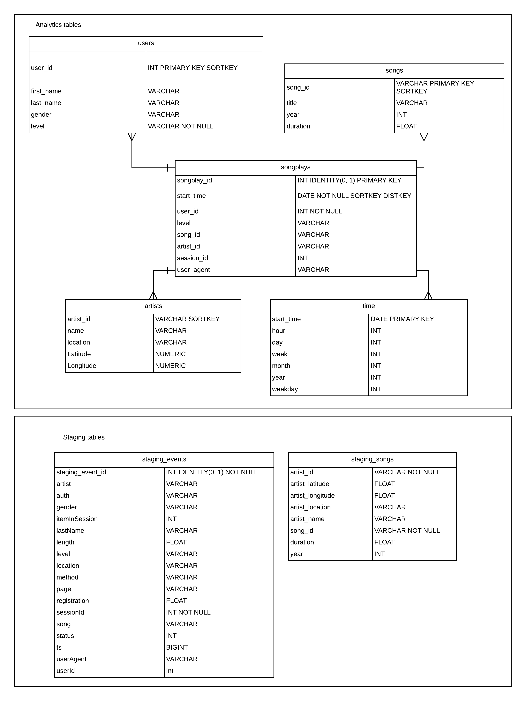

# Project 3: Data Warehouse
### Introduction
A music streaming startup, Sparkify, has grown their user base and song database and want to move their processes and data onto the cloud. Their data resides in S3, in a directory of JSON logs on user activity on the app, as well as a directory with JSON metadata on the songs in their app.

We are tasked with building an ETL pipeline that extracts their data from S3, stages them in Redshift, and transforms data into a set of dimensional tables for their analytics team to continue finding insights in what songs their users are listening to. We'll test the database and ETL pipeline by running queries given to you by the analytics team from Sparkify and compare the results with their expected results.

### Project Description
In this project, we'll apply what we've learned on data warehouses and AWS to build an ETL pipeline for a database hosted on Redshift. To complete the project, you will need to load data from S3 to staging tables on Redshift and execute SQL statements that create the analytics tables from these staging tables.

### Datasets
In this project we will use the **Songs dataset**, which is a subset of the Million Song Dataset. This is a dataset of files in JSON format and contains metadata of a song and the corresponding artist. It is constructed as follows
```json
{
  "num_songs": 1, "artist_id": "ARJIE2Y1187B994AB7", "artist_latitude": null, "artist_longitude": null, "artist_location": "", "artist_name": "Line Renaud", "song_id": "SOUPIRU12A6D4FA1E1", "title": "Der Kleine Dompfaff", "duration": 152.92036, "year": 0
}
```
The other dataset is the **log dataset** which consists of log files in JSON format that are generated by an event simulator based on the songs dataset. 

These datasets reside in AWS S3 buckets

### Database
The database is called sparkifydb and has a star schema. The *songplays* table is the fact table with business logic. The *songs, artists, users and time* tables are the dimension tables. For a SQL database, the star schema is the best option for data modeling. In this case the joins are simple and not expensive.

The **staging tables** are intermediate tables that have the datasets in S3 copied into them. It consists of the staging_events and the staging_songs table. staging_events contains data about what users and their actions. The staging_songs table contains data about songs and artists. Please find the ERD diagram below for all the schemas



### Getting started
- Make sure you have an account with AWS
- Use dwh_aws.ipynb to generate IAM role, create Redshift cluster, create security groups for cluster
- Create a configuration file with all AWS credentials stored and organized by cloud service
- Once everything is set up run the create_tables.py file in a terminal on your machine like such:  ```python create_tables.py```. This creates the tables and staging tables of the database
- Run the following command in your terminal: ```python etl.py``` to perform ETL operations on the tables.
- To test the queries, run the designated cells in the dwh_aws.ipynb jupyter notebook.
- Once these have run successfully, you can optionally delete the Redshift cluster and the IAM role for this project